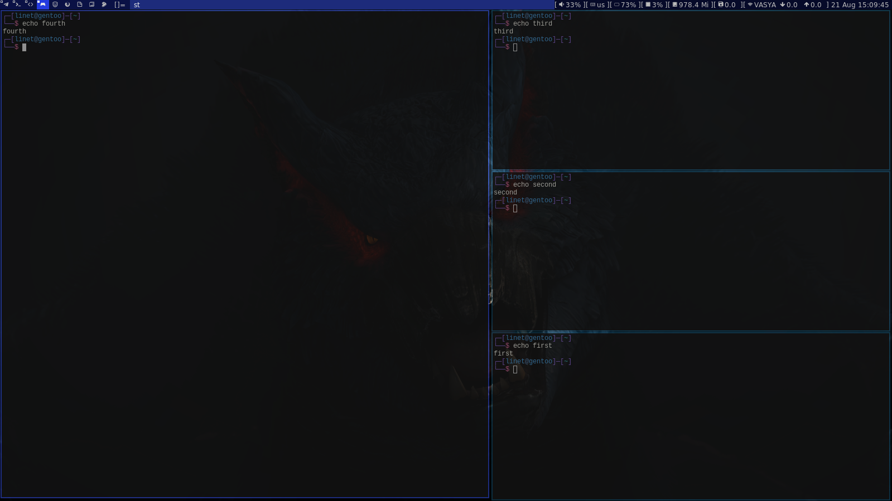
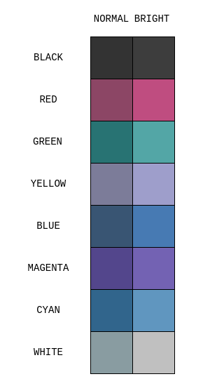

# Documentation on wtf is going on here (w.i.p. whenever I feel like ¯\\\_(ツ)_/¯)

## TODO:
- finally make a script that automatically sets it all over the place
- dwm shortcuts

### DWM explained

Full detailed explanation can be viewed on [suckless's tutorial](https://dwm.suckless.org/tutorial/)

DWM manages windows by putting them into two parts of screen:
- Master (to the left) - single window (usually, can be more), takes up a bit more than half of screen.
- Stack (to the right) - contains the rest of windows located one above the other.
When you add new windows to the screen - the newest one gets placed into the master and the window that used
to be there to the top of the stack. Here's an example, in terminals I echoed the order in which they were 
created.

### Colors

Terminal [st](https://st.suckless.org/) has got the following color scheme. It doesn't have too bright colors - something like yellow or lime-green - and keeps the overall blueish theme.

|Colors|Codes|
|------|-----|
||<table><tr><td>Normal</td><td>Bright</td></tr><tr><td>#333333</td><td>#3D3D3D</td></tr><tr><td>#8C4665</td><td>#BF4D80</td></tr><tr><td>#287373</td><td>#53A6A6</td></tr><tr><td>#7C7C99</td><td>#9E9ECB</td></tr><tr><td>#395573</td><td>#477AB3</td></tr><tr><td>#5E468C</td><td>#7E62B3</td></tr><tr><td>#31658C</td><td>#6096BF</td></tr><tr><td>#899CA1</td><td>#C0C0C0</td></tr></table>|
  
  
### DWM & other shortcuts

Note: "Mod" stands for that key with windows logo.

##### General

- **Mod+Enter** - open terminal (here set to `st`)

- **Mod+D** - open `dmenu` in status bar

- **Mod+[1-9]** - navigate to the workspace (screen) 1 to 9

- **Mod+Tab** - switch to last used workspace

- **Mod+0** - views all windows from the 9 workspaces

- **Mod+B** / **Mod+N** - navigate to the previous/next workspace (screen) - order-wisei

- **Mod+Shift+L** - lock screen (`slock`)

- **Mod+Shift+T** - switch to tiling mode

- **Mod+Shift+F** - switch to floating mode

- **Mod+Shift+M** - switch to monocle mode (all windows are maximized and under one another)

- **Mod+Shift+Space** - switch to the last used mode

- **Mod+Shift+Q** - end current dwm session

  
##### Window management & Navigation (Tiling mode)

- **Mod+T** - hide/show status bar

- **Mod+Q** - close focused window

- **Mod+H** / **Mod+L** - move the master-stack separator left/right.

- **Mod+J** / **Mod+K** - focus on the previous/next window (master -> stack from top to bottom).

- **Mod+U** / **Mod+I** - decrease/increase the numbers of windows in master (1 by default)

- **Mod+- (minus)** / **Mod+= (equal)** - decrease/increase the gaps between windows

- **Mod+Shift+= (equal)** - set the gaps between windows to minimal value (~0)

- **Mod+Shift+[1-9]** - move the window to master of specified workspace

- **Mod+Z** - move the focused window to master, previous master window goes to the top of the stack

##### Random apps I use relatively often and made shortcuts out of

- **Mod+Shift+I** - Neovim

- **Mod+Shift+O** - Librewolf

- **Mod+Shift+P** - Telegrami

##### Mouse usage

- **Mod+M1_Drag** - drag window "into floating mode" and move around

- **Mod+M2_Drag** - resize window (from bottom-right corner)

- **Mod+M3** - toggle window between floating and last mode

##### Terminal (`st`) shortcuts

- **Ctrl+Shift+PgUp/PgDn** - zoom terminal text in/out

- **Ctrl+Shift+Home** - reset terminal text size

- **Ctrl+Shift+C/V** - copy selected text to / paste from clipboard

- **Ctrl+Shift+Y / Shift+Insert** - paste the selected text into command line right away (doesn't write to clipboard)

- **Shift+PgUp/PgDn** - scroll terminal up or down

